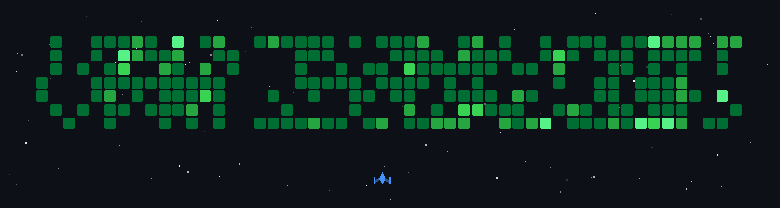

<div align="center">

# Ali Itawi

### Software Engineer · Backend & Systems · Security-Minded

I build software by understanding what happens **beneath the abstraction**.

From backend architecture and distributed systems
to HTTP servers, shells, version control internals, and reverse engineering.

<br/>

<a href="https://aliitawi.me">
  
</a>
<a href="https://www.linkedin.com/in/ali-itawi">
  
</a>
<a href="https://leetcode.com/u/AliItawi/">
  
</a>

</div>

---

## `whoami`

```text
name        Ali Itawi
role        Software Engineer @ Murex
location    Lebanon
education   B.Sc. Computer Science
            B.Sc. Mathematics
training    42 Beirut
focus       Backend · Systems · Architecture · Testing · Security
practice    800+ algorithmic problems
```

My background sits at the intersection of **software engineering and mathematics**.

I enjoy problems where correctness, performance, architecture, and low-level behavior actually matter — whether that means designing a backend service or understanding exactly what happens between an HTTP request and the operating system.

---

## Selected Engineering Work

<table>
<tr>
<td width="50%" valign="top">

### ⚡ [Code Forge](https://github.com/ITAXBOX/Code-Forge)

AI-powered full-stack application generator.

Turns natural-language application requirements into a generated **Spring Boot + Next.js** codebase.

`Spring Boot` `Next.js` `AI` `JUnit`

</td>

<td width="50%" valign="top">

### 🌑 [Void](https://github.com/ITAXBOX/Void)

A Git implementation written from scratch in C.

Object storage, binary index handling, packfiles, delta reconstruction, merging and transport internals.

`C` `Git Internals` `Systems` `zlib`

</td>
</tr>

<tr>
<td width="50%" valign="top">

### 🌐 [Webserv](https://github.com/ITAXBOX/Webserv)

Asynchronous HTTP/1.1 server implemented from scratch in C++98.

Built around an event-driven architecture with `epoll`, non-blocking I/O, CGI execution and HTTP parsing.

`C++98` `epoll` `HTTP/1.1` `CGI`

</td>

<td width="50%" valign="top">

### 🐚 [MINI_SHELL](https://github.com/ITAXBOX/MINI_SHELL)

A Bash-like Unix shell built from scratch.

Includes lexical analysis, parsing, pipelines, redirections, heredocs, expansion, signals and process management.

`C` `POSIX` `Processes` `Parsing`

</td>
</tr>

<tr>
<td width="50%" valign="top">

### 🔬 [Reverse Me](https://github.com/ITAXBOX/Reverse-Me)

Reverse-engineering exercises centered around understanding compiled binaries without source code.

`GDB` `Assembly` `C` `Binary Analysis`

</td>

<td width="50%" valign="top">

### 🔐 [Stockholm](https://github.com/ITAXBOX/Stockholm-ransomware-simulator)

Educational ransomware simulator built for isolated security research.

Uses authenticated encryption, password-based key derivation and containerized execution.

`Java` `AES-256-GCM` `PBKDF2` `Docker`

</td>
</tr>
</table>

---

## Engineering Toolbox

<div align="center">


</div>

<br/>

```text
LANGUAGES
Java · C · C++ · TypeScript · JavaScript · Python · SQL · Bash

BACKEND
Spring Boot · Hibernate · Express.js · REST · Next.js

DATA
PostgreSQL · MySQL · MongoDB · Redis

INFRASTRUCTURE
Linux · Docker · Git · Jenkins · CI/CD

TESTING
JUnit · Playwright · Integration Testing · E2E Testing

ENGINEERING
System Design · Data Structures & Algorithms · Design Patterns
SOLID · OOP · Networking · Operating Systems · Security
```

---

## GitHub

<div align="center">


<br/>


</div>

---

## Algorithms

<div align="center">

<a href="https://leetcode.com/u/AliItawi/">
  
</a>

</div>

---

## Beyond the Code

Mathematics taught me to **reason**.

Software engineering taught me to **build**.

Systems programming taught me to **question abstractions**.

And solving hundreds of algorithmic problems taught me that there is almost always another way to look at a problem.

---

<div align="center">

### Build deeply. Understand completely. Improve continuously.

<br/>

<a href="https://aliitawi.me"><b>aliitawi.me</b></a>
  ·   <a href="https://github.com/ITAXBOX"><b>GitHub</b></a>
  ·   <a href="https://www.linkedin.com/in/ali-itawi"><b>LinkedIn</b></a>
  ·   <a href="https://leetcode.com/u/AliItawi/"><b>LeetCode</b></a>

</div>

<br/>


